# Exploring-the-Determinants-of-Economic-Growth-in-North-Africa-An-Analysis-of-Key-Variables
The README file offers a concise overview of the project, outlining the data sources, research methods, and significant findings. It acts as a useful reference to familiarize yourself with the organization of the repository and the outputs presented within it.

## Summary
In this project, the focus was on identifying the key variables that contribute to economic growth in North African countries, specifically Algeria, Egypt, Libya, Morocco, and Tunisia. To achieve this, the project considered a range of different variables from both economic and non-economic spheres, including trade, foreign direct investment (FDI), political stability, and education.

The analysis revealed that there is no single variable that can be identified as the sole contributor to GDP growth in these countries. Rather, it is a combination of different variables that come into play. However, the research did identify political stability and trade openness as being particularly important factors that have a significant impact on economic growth.

In summary, the project sought to provide a comprehensive understanding of the factors that underpin economic growth in North African countries, with a particular focus on identifying the key variables that policymakers should prioritize in their efforts to promote growth and development in the region.

## Data
The data utilized in my research was obtained from The Humanitarian Data Exchange, which provides access to several indicators by country. I primarily relied on a comprehensive dataset titled "Economic, Social, Environmental, Health, Education, Development, and Energy" containing data from the World Bank's data portal. This dataset covers various topics such as Agriculture and Rural Development, Aid Effectiveness, Economy and Growth, Education, Energy and Mining, Environment, Financial Sector, Health, Infrastructure, Social Protection and Labor, Poverty, Private Sector, Public Sector, Science and Technology, Social Development, Urban Development, Gender, Climate Change, External Debt, and Trade.

My analysis focused on two main metrics, namely Economy and Growth and Education. Economic growth is essential to promoting economic development, and data on measures such as gross domestic product (GDP) and gross national income (GNI), as well as factors such as capital stock, employment, investment, savings, consumption, government spending, imports, and exports, can help policymakers gain a better understanding of their country's economic situation and guide any efforts to improve it.

Education is also critical for reducing poverty and inequality and laying the foundation for sustained economic growth. I obtained education-related data from the United Nations Educational, Scientific, and Cultural Organization (UNESCO) Institute for Statistics, which compiles data on education inputs, participation, efficiency, and outcomes.

Furthermore, I also looked at the political stability metric, for which I used the Worldwide Governance Indicators (WGI) project. The WGI project provides aggregate and individual governance indicators for over 200 countries and territories, covering six dimensions of governance: Voice and Accountability, Political Stability and Absence of Violence/Terrorism, Government Effectiveness, Regulatory Quality, Rule of Law, and Control of Corruption. These indicators are based on over 30 individual data sources produced by various organizations, including survey institutes, think tanks, non-governmental organizations, international organizations, and private sector firms.	

## Running Scripts

[plot_gdp.py](./plot_gdp.py)
The code provided reads and cleans GDP per capita growth data for selected North African countries, specifically Algeria, Egypt, Morocco, Libya, and Tunisia, from a CSV file. It renames the "Egypt, Arab Rep." row to "Egypt" and filters the dataframe to only include GDP per capita growth (annual %) data for the years 2014 and later. The cleaned data is then pivoted so that each country is a column and each year is a row, and normalized to the base year of 2014. Finally, the code creates a line plot of the normalized GDP per capita growth rates for each country over time, with a title indicating the base year and axes labeled appropriately. The plot is saved as a PNG file and displayed.

This code provides an analysis of the evolution of GDP per capita growth rate for selected North African countries with a focus on identifying trends in economic performance and providing insights into the factors driving economic growth in the region.
The final output is a graph that illustrates the changes in GDP per capita over time.

[plot_trade.py](./plot_trade.py)
This code analyzes trade data for selected North African countries to determine its influence on economic growth. The resulting graphs illustrate the trade balance for each country and how it has evolved over time, providing valuable insight into the impact of trade on the economic growth of these nations. Additionally, the analysis explores whether trade openness has a positive effect on GDP growth, which could explain the overall economic growth of a country.

[plot_fdi.py](./plot_fdi.py)
The code aims to analyze the Foreign Direct Investment (FDI) data to determine its impact on economic growth. The analysis involves generating distinct bar graphs for each country, displaying the changes in FDI inflows relative to the years 2001, 2011, and 2021.

[plot_education.py](./plot_education.py)
The graphics in this code aim to analyze the effect of education on economic growth in North African countries. The first graph shows the evolution of the Barro-Lee indicator for total years of schooling among individuals aged 25 and above in four North African countries (Tunisia, Egypt, Libya, and Algeria) from 1970 to 2018. The Barro-Lee indicator is a metric that represents the average years of total schooling for individuals aged 25 and above, and it is widely used in the analysis of the effect of education on economic growth. 

The graph helps to visualize the trend of education in North African countries over time.
The second graph is a scatter plot that displays the relationship between the Barro-Lee indicator for total years of schooling among individuals aged 25 and above and the GDP growth rate in North African countries. This plot helps to identify if there is a correlation between the level of education and economic growth in North African countries. The graph also provides an insight into whether investment in education is a good strategy for promoting economic growth in North African countries.

## Analysis and Results
We initiated our analysis by examining the GDP growth rates of each country with a base year of 2014, which serves as a fair benchmark for subsequent years. Our analysis does not incorporate the impact of COVID-19.
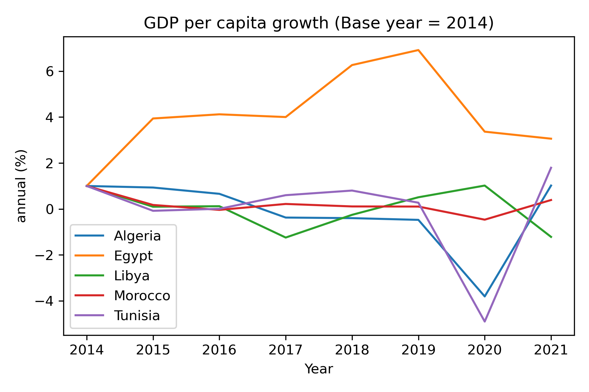
The observed variation in GDP growth rates can be attributed to differences in natural and human capital endowments.
Algeria, being the largest country in Africa with a population of over 44.18 million, has traditionally relied heavily on its oil and gas industries as major sources of economic output.
Egypt, with a population of over 10xc9.3 million, boasts a diversified economy with emphasis on tourism, manufacturing, and agriculture.
Libya, with a population of just over 6.7 million, is also a significant exporter of oil and gas, however, its economy has been heavily influenced by political instability and conflict in recent times.
Morocco, with a population of over 37.08 million, has a diverse economy with an emphasis on agriculture, manufacturing, and tourism. In recent years, Morocco has implemented economic reforms aimed at boosting trade and investment.
Tunisia, with a population of just over 12.6 million, has a diversified economy with an emphasis on agriculture, manufacturing, and tourism. Like Morocco, Tunisia has implemented several economic reforms recently aimed at promoting trade and investment.

### Poliyical Stability
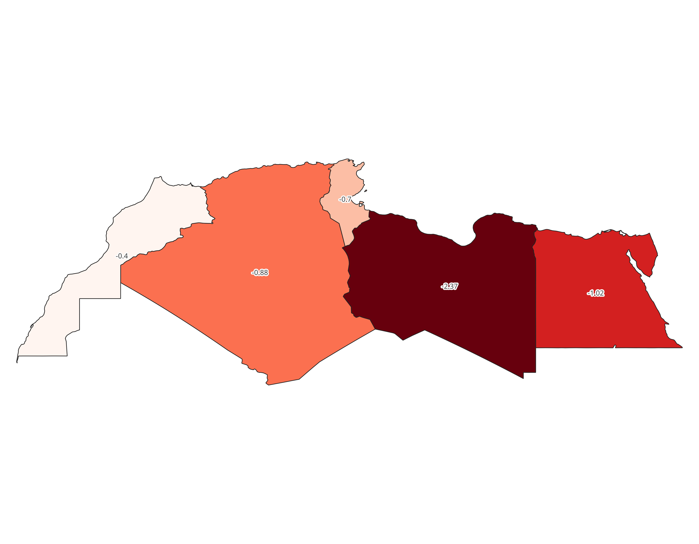
It was crucial to analyze the political systems of each country as it can reflect the political stability metric, which is an important factor affecting economic growth. The following observations were made:
1.	Algeria has been a one-party state since its independence from France in 1962. The government has faced challenges related to corruption and military influence on the economy, which may have led to a lack of confidence among investors and slowed economic growth.
2.	Egypt has a history of political instability, including a revolution in 2011 that led to the ouster of longtime President Hosni Mubarak. The government has recently cracked down on political opposition and civil society, and the COVID-19 pandemic has also impacted the economy. These factors may have led to uncertainty among investors and slowed economic growth.
3.	Libya has been in a state of conflict since the overthrow of former dictator Muammar Gaddafi in 2011. The ongoing conflict has disrupted oil production and other economic activities, and the country has been divided between two rival governments. These factors have likely had a significant negative impact on economic growth.
4.	Morocco has a relatively stable political system, with a constitutional monarchy and an elected parliament. The government has implemented several economic reforms to promote trade and investment, but the country has also faced challenges related to corruption and political opposition. The overall impact of the political context in Morocco on economic growth is likely mixed.
5.	Tunisia has a relatively democratic political system, with regular elections and a relatively free press. However, the country has faced challenges related to political instability, including the ouster of longtime President Zine El Abidine Ben Ali in 2011. The government has implemented several economic reforms to promote trade and investment, but the overall impact of the political context on economic growth in Tunisia is also likely mixed.

### Trade and FDIs

The economic reforms undertaken by the North African countries have been instrumental in promoting economic growth in the region. Economic liberalization, privatization, and removal of price controls are some of the key reforms that have been implemented across the region. These reforms have helped to reduce the state's role in the economy and promote foreign investment.

Foreign Direct Investment (FDI) has played an important role in promoting economic growth in the region. As we can observe, all North African countries except Libya have received significant amounts of FDI, which has translated into economic growth. FDI inflows can have a positive impact on the economy and can accelerate the pace of economic growth, particularly in developing countries. However, it's important to note that the inflow of FDI also relies on the country's openness to trade and the different agreements made with other countries around the world.

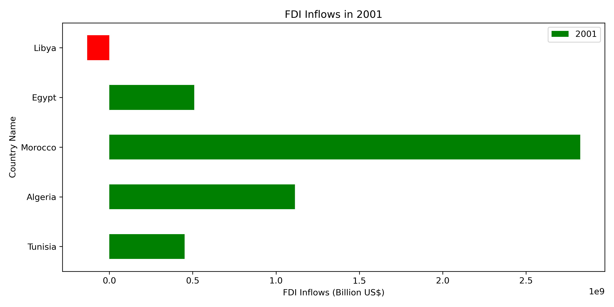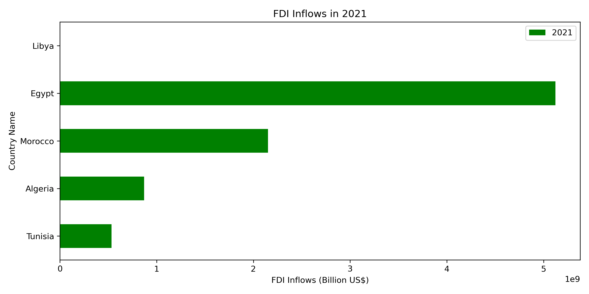

Trade is another important indicator of a country's openness and can promote economic growth through technological transfers, competitiveness advantage, and an increase in economies of scale. Even though some North African countries like Algeria and Libya are rich in natural resources and tend to export more than they import, they do not reflect steady and sustained growth per capita. On the other hand, Morocco and Tunisia, even though net importers, tend to be more resilient against the market, reflecting a more steady and sustained growth. This suggests that the role of trade in promoting economic growth is not solely dependent on the export of natural resources.

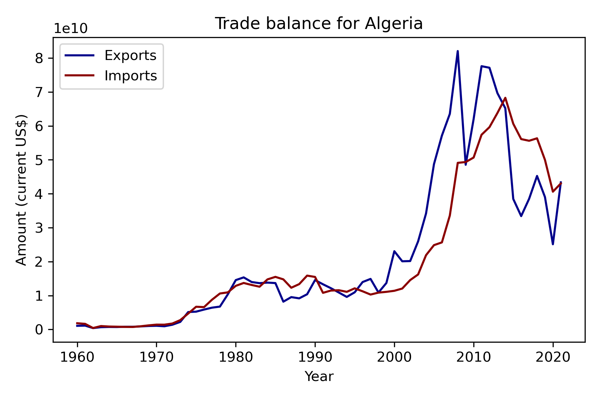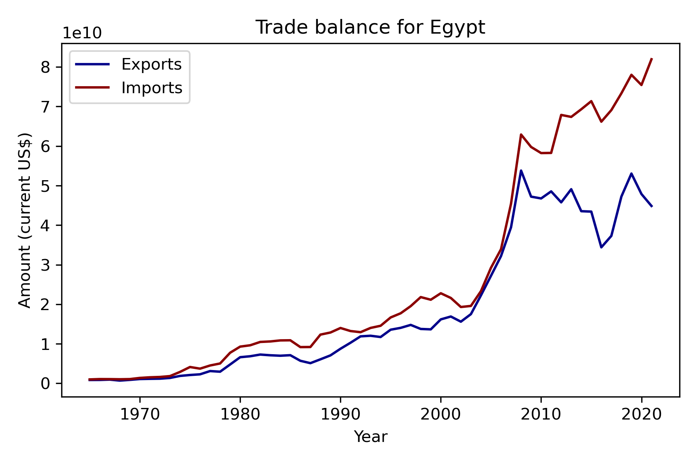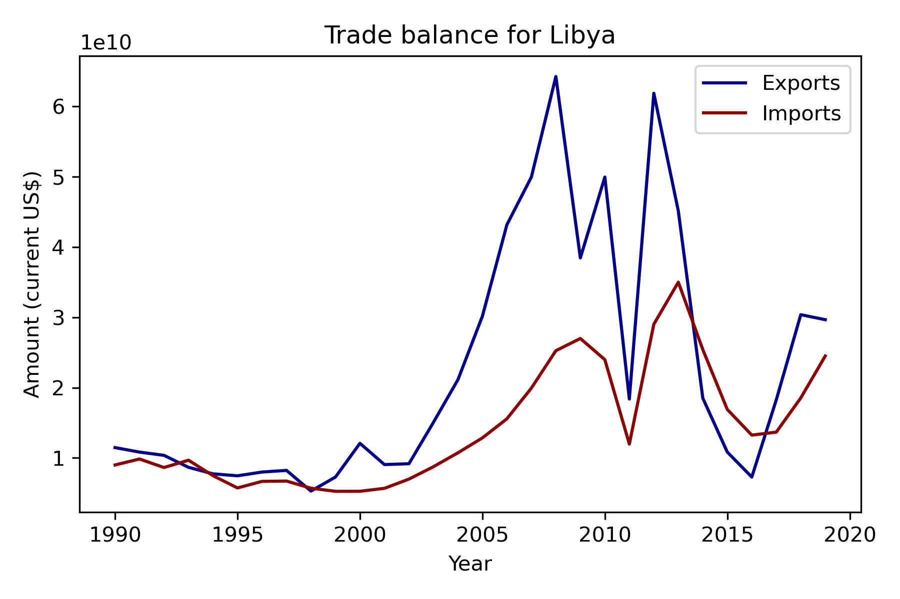
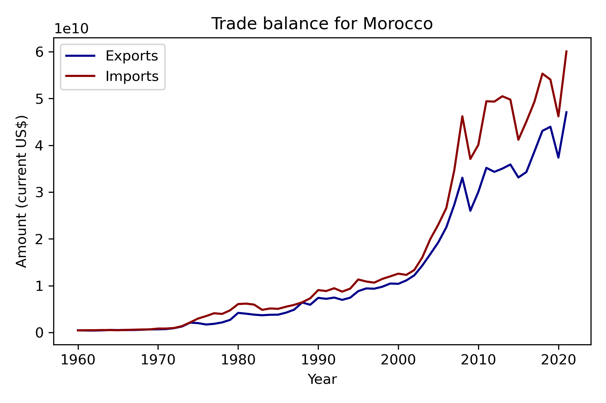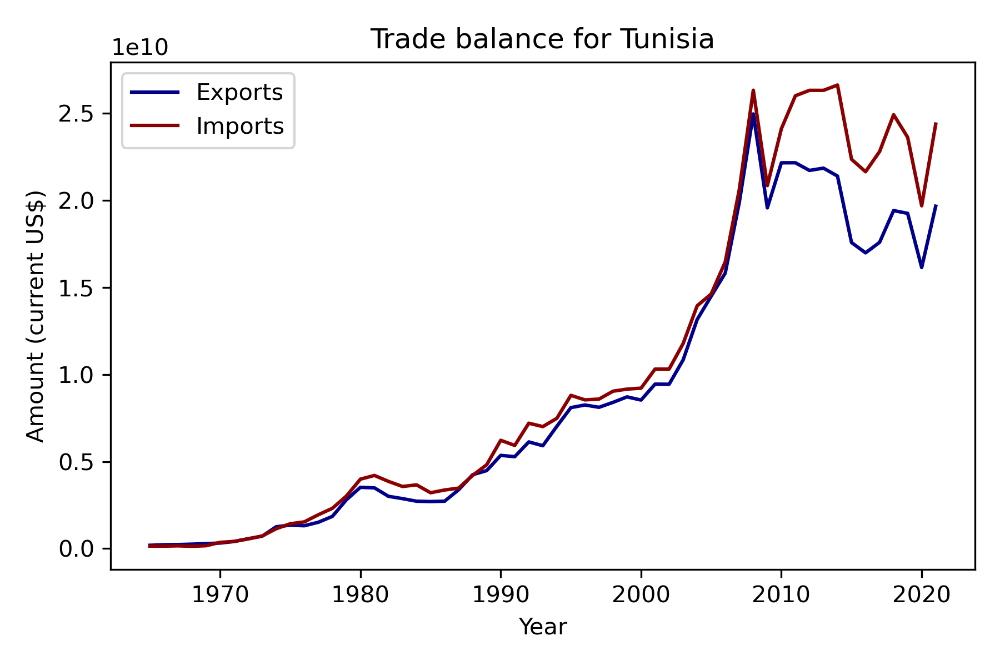

As for education, the scatter plot analysis shows a positive relationship between GDP per capita and the average years of schooling, suggesting that countries with higher levels of education tend to have higher levels of economic growth. This is consistent with the theory that human capital plays a crucial role in economic development.

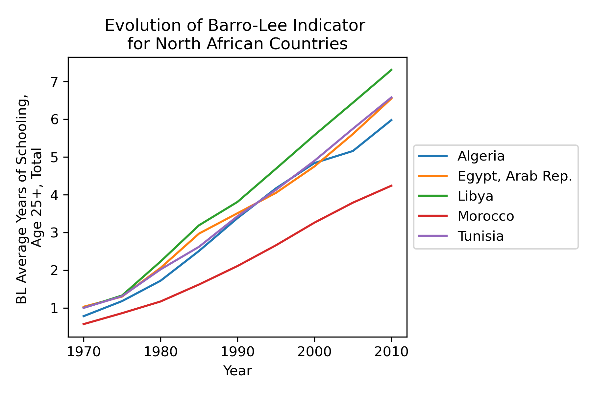

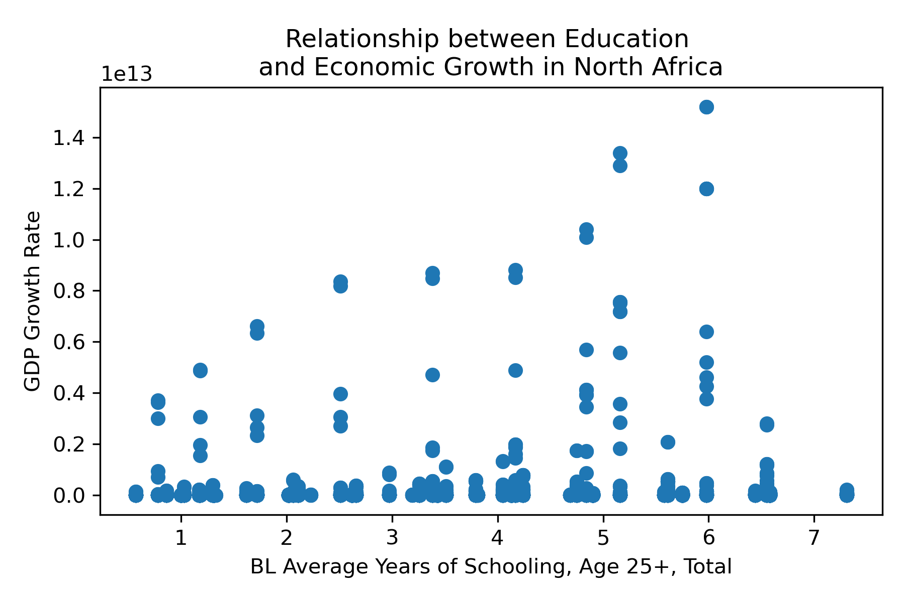

In conclusion, the analysis of the four variables - political stability, openness, economic reforms, and education - provides insights into the different factors that contribute to economic growth in North African countries. While natural resources can play a role in economic growth, the results suggest that countries with more diversified economies and greater openness to trade tend to experience more sustainable and steady economic growth. Additionally, political stability and the implementation of economic reforms that promote investment and reduce state control over the economy can also contribute to economic growth. Finally, the positive relationship between education and economic growth highlights the importance of investing in human capital as a means of fostering sustainable economic development.
